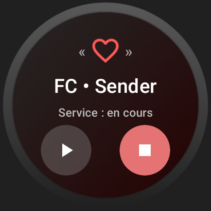
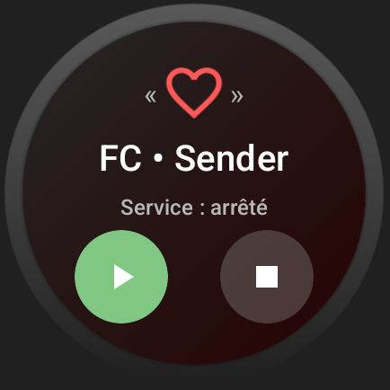

# Heart Rate Sender - Pixel Watch ❤️

**Heart Rate Sender** est une application pour Wear OS (Google Pixel Watch) permettant de :

- Lire en temps réel ma fréquence cardiaque.
- Que je puisse démarrer/arrêter manuellement l'envoie des mesures.
- Envoyer la fréquence sur un serveur et après la récupérer afin de l'afficher sur mon téléphone perso.

 

## 🖼️ Visuels
|            Service démaré            |            Service stoppé            |
|:------------------------------------:|:------------------------------------:|
|  |  |

 

## 🎯 Objectifs

- [x] Lecture du Rythme Cardiaque via `Health Services API`.
- [x] Interface Wear OS avec boutons "Démarrer" et "Arrêter".
- [x] Notification permettant d'indiquer que l'application est en cours
- [x] Envoyer des données à une API privée

 

## 📦 Stack Technique
- **Langage** : Kotlin
- **Cible** : Wear OS 4 (Pixel Watch, compatibles Android 14+)
- **API de santé** : `androidx.health:health-services-client`
- **Interface** : Compose for Wear OS
- **Services** : Foreground Service Health (`ServiceInfo.FOREGROUND_SERVICE_TYPE_HEALTH`)

 

## 🧡 Auteur
- On va pas se le cacher, je suis très honnête avec vous, je suis pas développeur Kotlin ni Android, donc c'est clairement du ChatGPT. Merci à lui il a fait 90% du taff. Je me permets de m'octroyer les 10% restants car pour l'instant ce n'est pas non plus une lumière et que les IA ne sont pas prêtes à nous remplacer 🤡

